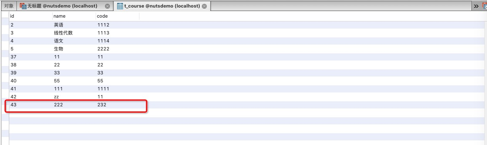

# CRUD程序员的福音-零代码WebAPI快速开发系统，零代码开发API接口(QQ:2914709646 有需要请联系)
## 一、数据库管理：可以创建、删除，查询数据库表
## 二、API管理：可以创建、修改、删除、查询API接口，自定义API接口查询条件、数据表连接条件、分组统计、返回字段格式等
#### 说明：零代码WebAPI快速开发系统可以实现无需编写任何代码，通过网页配置即可生成API接口的功能，节省大量重复开发的CRUD代码，（复杂业务还是需要单独开发）
#### 技术栈：后台springboot,nutz,前台：vue+bootstrap

## 启动方式：
1. 代码通过git clone https://gitee.com/lonele/api-gen.git 下载到本地
2. 使用vscode或者IDEA打开项目，下载pom文件中的依赖包
3. 安装mysql5.2.7数据库，修改application.yml中的配置（system:dbName: nutsdemo  #一定要配置，默认数据库）
4. 运行WebApplication.java
5. 浏览器打开http://localhost:8088/pages/index.html 即可使用

## 使用约定和方法
1. 数据库使用mysql数据库
2. 数据表和字段均有中文备注（会自动生成api接口文档的相关信息）
3. 数据库主键均使用小写id作为自增主键（编辑、删除、查询单个数据均默认使用id作为条件）
4. 所有接口的配置方式都是一致的：先选数据表，然后加载表信息，然后配置条件字段和结果字段，保存即可。

## 可以配置的5种接口类型
1. 查询接口，支持单表查询和多表查询
2. 单表主键查询接口：支持单表根据id查询
3. 单表插入接口：支持单表插入数据，支持选择插入的字段，传入字段为jsonbody格式
4. 单表编辑接口：支持单表编辑数据，支持选择编辑的字段，默认根据id编辑，传入字段为jsonbody格式
5. 单表删除接口：支持单表删除数据，支持逻辑删除和物理删除，默认根据id删除
说明：查询接口不支持嵌套查询，查询条件为jsonbody格式

## 运行效果截图
### 添加数据库表

### API管理页面

### 编辑多表查询接口（可以设置多个查询条件，自定义返回字段）

### 编辑单表主键查询接口

### 编辑插入接口

